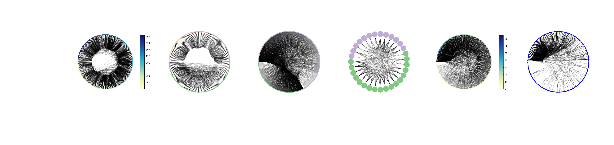

# Network Analysis Made Simple

Welcome to the GitHub repository for Network Analysis Made Simple! This is a tutorial designed to teach you the basic and practical aspects of graph theory. It has been presented at multiple conferences (PyCon, SciPy, PyData, and ODSC) in a variety of formats (ranging from 1.5 hr to 4 hour long workshops). The material is designed for a live tutorial presentation, with the code available for you to reference afterwards.

## Getting Started

### Binder

(Consider this option only if your WiFi is stable)

If you don't want the hassle of getting setup, you can use the Binder service to participate in the live tutorial. Just click on the button below:

### Notebook HTML Versions

For tutorial participants who may run into technical issues, full HTML versions of the notebooks are available to follow along during the tutorial.

- [NB0: Pre-Tutorial Exercises](http://ericmjl.github.io/Network-Analysis-Made-Simple/0-pre-tutorial-exercises.html)
- [NB1: Introduction](http://ericmjl.github.io/Network-Analysis-Made-Simple/1-introduction.html)
- [NB2: Network Basics](http://ericmjl.github.io/Network-Analysis-Made-Simple/2-networkx-basics-instructor.html)
- [NB3: Hubs and Paths](http://ericmjl.github.io/Network-Analysis-Made-Simple/3-hubs-and-paths-instructor.html)
- [NB4: Cliques, Triangles and Structures](http://ericmjl.github.io/Network-Analysis-Made-Simple/4-cliques-triangles-structures-instructor.html)
- [NB5: Graph I/O](http://ericmjl.github.io/Network-Analysis-Made-Simple/5-graph-input-output-instructor.html)
- [NB6: Bipartite Graphs](http://ericmjl.github.io/Network-Analysis-Made-Simple/6-bipartite-graphs-instructor.html)
- [NB7: Case Study on Game Of Thrones](http://ericmjl.github.io/Network-Analysis-Made-Simple/7-game-of-thrones-case-study-instructor.html)
- [NB8: Case Study on US Airports](http://ericmjl.github.io/Network-Analysis-Made-Simple/8-US-airports-case-study-instructor.html)
- [Bonus Notebook: Network Statistical Inference](http://ericmjl.github.io/Network-Analysis-Made-Simple/bonus-1-network-statistical-inference-instructor.html)
- [Bonus Notebook: Graph Matrix Representations](http://ericmjl.github.io/Network-Analysis-Made-Simple/bonus-3-matrices-instructor.html)

### Local Setup

For those of you who would like to get setup beforehand and keep a local copy of the repository on your machine, follow along here.

#### Easiest way: Anaconda Distribution of Python

If you have the Anaconda distribution of **Python 3** installed on a Unix-like machine (Linux, macOS, etc.), then run `make conda`, which wraps the commands below.

1. `$ conda env create -f environment.yml`
1. `$ source activate nams`
1. `$ python checkenv.py`

If you do not have the Anaconda distribution, I would highly recommend getting it for [Windows][2], [Mac][3] or [Linux][4]. It provides an isolated Python computing environment that will not interfere with your system Python installation, and comes with a very awesome package manager (`conda`) that makes installation of new packages a single `conda install pkgname` away.

If you're not using Python 3, then check out @jakevdp's talk at SciPy2015 to find out why!

#### Alternative to Anaconda: `pip install`

For those who do not have the capability of installing the Anaconda Python 3 distribution on their computers, please follow the instructions below.

Run `make venv`, which wraps up the commands below. Special thanks to @matt-land for putting this script together.

1. Create a virtual environment for this tutorial, so that the installed packages do not mess with your regular Python environment.
    2. `$ pip install virtualenv`
    3. `$ virtualenv network`
    4. `$ source network/bin/activate`
5. `$ pip install matplotlib networkx pandas hiveplot numpy jupyter`

Check your environment:

1. `$ python checkenv.py`

#### Manual Build

For this tutorial, you will need the following packages:

1. Python 3
2. `matplotlib`
3. `networkx`
4. `pandas`
5. `hiveplot` - `conda install -c conda-forge hiveplot` or `pip install hiveplot`.
1. `nxviz` - `conda install -c conda-forge nxviz`.  (This implements Circos plots; HivePlots are being migrated over.)
6. `numpy`
7. `scipy`

Then, clone the repository locally.

1. `$ cd /path/to/your/directory`
1. Clone the repository to disk:
    1. `$ git clone https://github.com/ericmjl/Network-Analysis-Made-Simple.git`
1. `$ cd Network-Analysis-Made-Simple`

### Run the Jupyter Notebook

    $ jupyter notebook

Your browser will open to an index page where you can click on a notebook to run it. Test that everything runs fine by executing all of the cells in the Instructor versions of the notebooks.

# Feedback

If you've attended this workshop, please leave [feedback][7]! It's important to help me improve the tutorial for future iterations.

# Issues

## Known Issues

If you get a "Python is not installed as a framework" error with matplotlib, please check out [this issue][8] for instructions to resolve it.

## New Issues

If you're facing difficulties, please report it as an [issue][1] on this repository.

# Credits

1. [Divvy Data Challenge](https://www.divvybikes.com/datachallenge)
1. [Konect Network Analysis Datasets](http://konect.uni-koblenz.de/networks/)

# Resources

1. Jon Charest's use of Circos plots to visualize networks of Metal music genres. [blog post][5] | [notebook][6]
1. Gain further practice by taking this course online at [DataCamp](http://www.datacamp.com/)!
1. A gentle introduction to graph theory on [Vaidehi Joshi's website](https://dev.to/vaidehijoshi/a-gentle-introduction-to-graph-theory)

[1]: https://github.com/ericmjl/Network-Analysis-Made-Simple/issues
[2]: http://repo.continuum.io/archive/Anaconda3-4.0.0-Windows-x86_64.exe
[3]: http://repo.continuum.io/archive/Anaconda3-4.0.0-MacOSX-x86_64.pkg
[4]: http://repo.continuum.io/archive/Anaconda3-4.0.0-Linux-x86_64.sh
[5]: http://jonchar.net/2016/05/20/exploring-metal-subgenres-with-python.html
[6]: http://jonchar.net/notebooks/MA-Exploratory-Analysis#Enter-the-Circos-plot
[7]: https://ericma1.typeform.com/to/aCljQl
[8]: https://github.com/ericmjl/Network-Analysis-Made-Simple/issues/8
